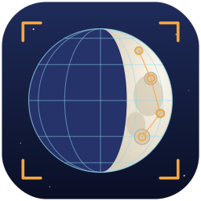
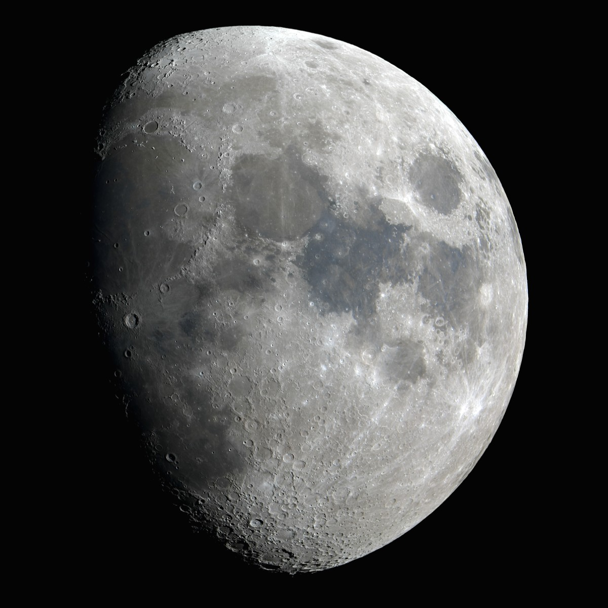
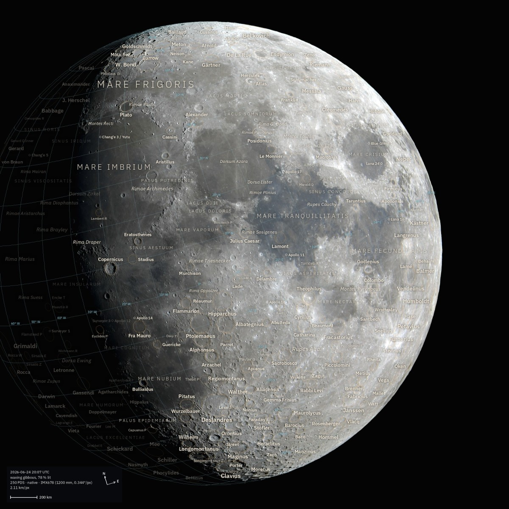
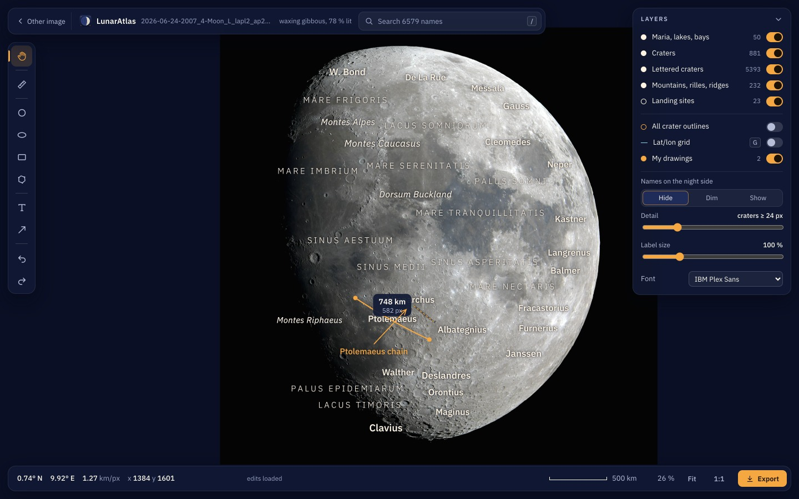
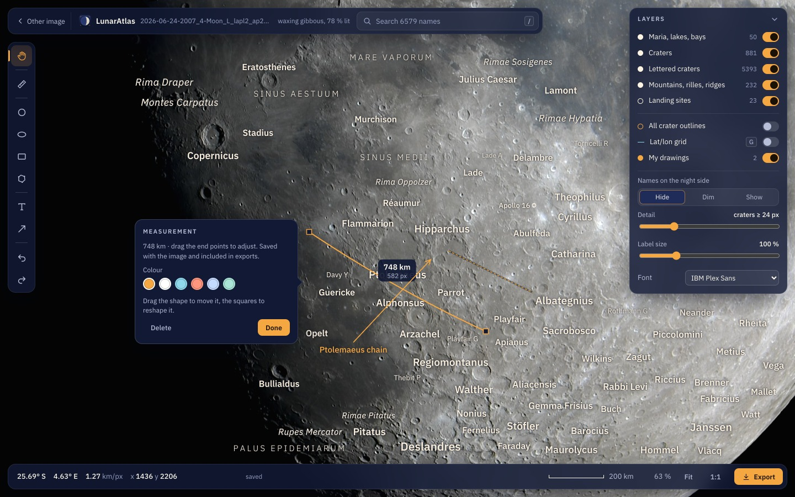
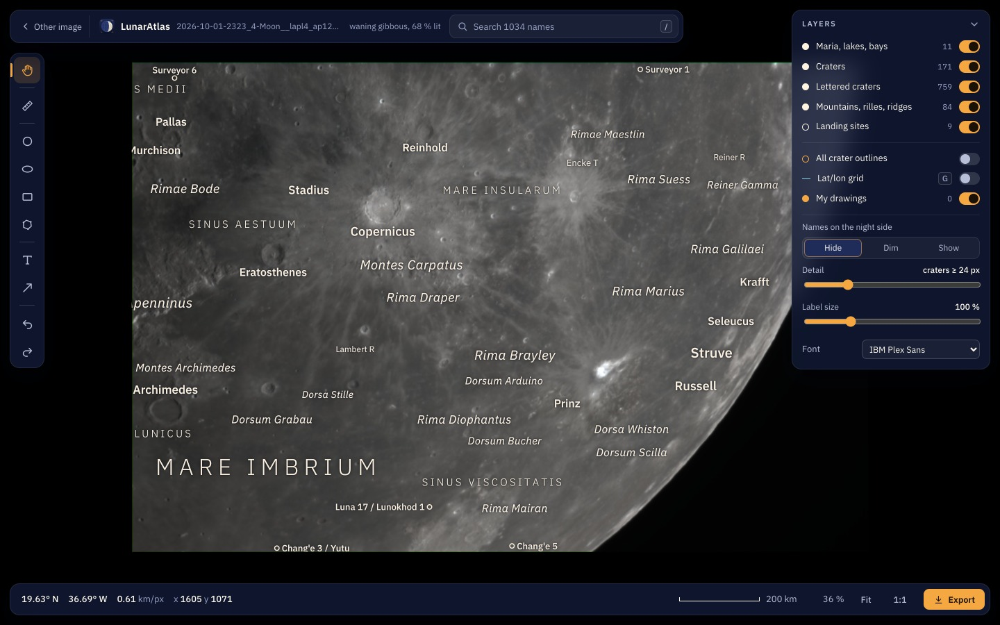
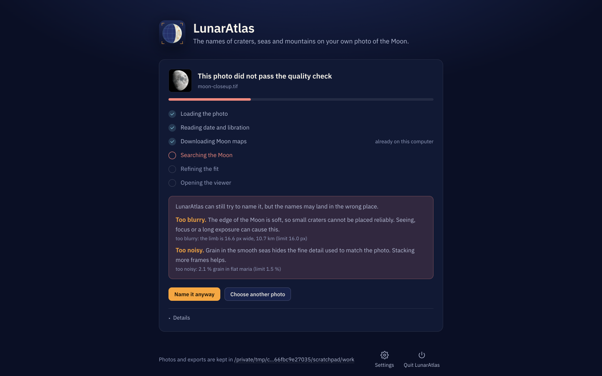
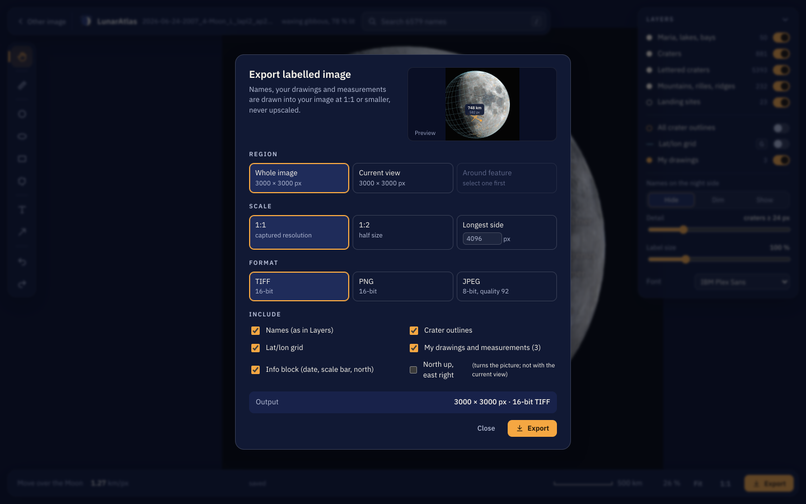
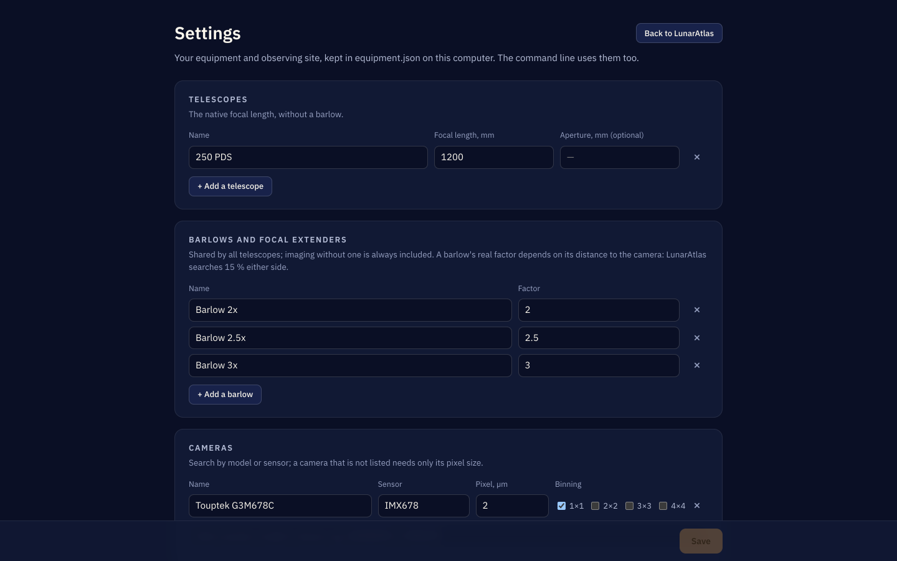

<div align="center">



# LunarAtlas

**The names of craters, seas and mountains — on your own photo of the Moon.**

Like LROC QuickMap, but with your data.

<p>
  <a href="https://github.com/kvandebeek/lunaratlas/releases/latest"></a>
  <a href="https://github.com/kvandebeek/lunaratlas/wiki"></a>
  <a href="LICENSE"></a>
</p>

<p>
  <a href="https://github.com/kvandebeek/lunaratlas/actions/workflows/test.yml"></a>
  <a href="https://github.com/kvandebeek/lunaratlas/actions/workflows/browsers.yml"></a>
  <a href="https://github.com/kvandebeek/lunaratlas/actions/workflows/build-app.yml"></a>
</p>

</div>

<table>
<tr>
<td width="50%" align="center"></td>
<td width="50%" align="center"></td>
</tr>
<tr>
<td align="center"><b>Your photo.</b><br>No coordinates, no plate solving, no calibration.</td>
<td align="center"><b>Twenty seconds later.</b><br>Position, orientation, mirroring and libration, worked out from the picture itself.</td>
</tr>
</table>

<div align="center">

Full disks, any phase, mosaics, and close-ups that show no edge of the Moon at all.<br>
It refuses photos too poor to annotate rather than guessing, and exports at 1:1 or smaller — never upscaled.

</div>

---

## Download

No terminal needed. Get the app, start it, drop a photo of the Moon on its window.

<div align="center">

| macOS | Windows | Linux |
|:--:|:--:|:--:|
| `.dmg` | installer `.exe` | `.tar.gz` |
| Apple silicon &amp; Intel | per user, no admin rights | with an optional menu entry |

### [⬇ Releases](https://github.com/kvandebeek/lunaratlas/releases)

</div>

Exports go to `Pictures/LunarAtlas`. The first photo downloads about 145 MB of Moon maps, once; the first
close-up about 530 MB more. After that it works offline.

> **New here?** [Installing](https://github.com/kvandebeek/lunaratlas/wiki/Installing) →
> [Your first photo](https://github.com/kvandebeek/lunaratlas/wiki/Your-first-photo) →
> [The viewer](https://github.com/kvandebeek/lunaratlas/wiki/The-viewer)

---

## What you get

<table>
<tr>
<td width="50%"></td>
<td width="50%"></td>
</tr>
<tr>
<td><b>A viewer, not a static picture.</b> 9087 IAU features — maria, craters, lettered satellites, mountains, rilles, ridges — plus landing sites. Names appear as you zoom in and there is room for them.</td>
<td><b>Measure in kilometres</b> along the Moon's curved surface, not flat across your pixels. Draw circles, arrows, outlines and text, and label them with the names already nearby.</td>
</tr>
<tr>
<td width="50%"></td>
<td width="50%"></td>
</tr>
<tr>
<td><b>Close-ups without a limb.</b> No edge of the Moon to fit a circle to, so it searches the whole near side for the matching terrain — given the capture time and what took the picture.</td>
<td><b>It refuses rather than guesses.</b> A quality check measures the photo first and explains what is wrong, in plain language. You can override it; the photo keeps the warning.</td>
</tr>
<tr>
<td width="50%"></td>
<td width="50%"></td>
</tr>
<tr>
<td><b>Export what you see</b> as 16-bit TIFF, 16-bit PNG or JPEG, with a live preview. Your edits — hidden names, moved names, drawings — are kept and reused by the command line.</td>
<td><b>Your equipment, asked once.</b> Telescopes, barlows and cameras, searched by model or sensor. Your observing site stays on your computer and is never written into an export.</td>
</tr>
</table>

---

## Command line

```sh
python3 lunaratlas/lunaratlas.py locate mosaic_finished.tif    # position it (10–20 s; close-ups 30–100 s)
python3 lunaratlas/lunaratlas.py view   mosaic_finished.tif    # the viewer and editor
python3 lunaratlas/lunaratlas.py export mosaic_finished.tif --around Copernicus --fit
python3 lunaratlas/lunaratlas.py batch  ~/Pictures/session --max-size 2400
```

<div align="center">

**Measured on a 200 Mpx lunar mosaic: 621 terrain matches at 1.56 px RMS — 0.43 km.**

Across 590+ test files, no confidently-wrong result.

</div>

Every command and option: [**The command line**](https://github.com/kvandebeek/lunaratlas/wiki/The-command-line).
How the positioning actually works: [**How it works**](https://github.com/kvandebeek/lunaratlas/wiki/How-it-works).
What it cannot do: [**Limits**](https://github.com/kvandebeek/lunaratlas/wiki/Limits).

---

## The manual

The [**wiki**](https://github.com/kvandebeek/lunaratlas/wiki) is the manual, written for someone holding a
photo rather than reading the code. Its source lives in [`Wiki/`](Wiki/).

<div align="center">

| | | |
|:--|:--|:--|
| [Installing](https://github.com/kvandebeek/lunaratlas/wiki/Installing) | [Your first photo](https://github.com/kvandebeek/lunaratlas/wiki/Your-first-photo) | [The viewer](https://github.com/kvandebeek/lunaratlas/wiki/The-viewer) |
| [Exporting](https://github.com/kvandebeek/lunaratlas/wiki/Exporting) | [Close-ups and equipment](https://github.com/kvandebeek/lunaratlas/wiki/Close-ups-and-equipment) | [The quality check](https://github.com/kvandebeek/lunaratlas/wiki/The-quality-check) |
| [Troubleshooting](https://github.com/kvandebeek/lunaratlas/wiki/Troubleshooting) | [Settings reference](https://github.com/kvandebeek/lunaratlas/wiki/Settings-reference) | [Files and folders](https://github.com/kvandebeek/lunaratlas/wiki/Files-and-folders) |

</div>

---

## From a checkout

macOS, Linux or Windows, with Python 3.14, numpy, OpenCV and Pillow:

```sh
python3 -m pip install -r requirements.txt
python3 lunaratlas/lunaratlas.py app          # the same window the app opens
```

Developed and measured on macOS (Apple silicon). Linux and Windows are built and tested on every change
but have had far less real use — do tell me if something is wrong there.

Per-machine settings live in `.env`, which is not committed; [`.env.example`](.env.example) lists every key
with its default. All settings are declared once in [`tool_settings.py`](tool_settings.py) with their type,
default and range, and `.env.example` is generated from it:

```sh
python3 tool_settings.py --check      # the value in effect for every setting, with warnings
python3 tool_settings.py --example    # regenerate .env.example
```

Precedence: command-line option → environment variable → `.env` → built-in default.

| | |
|---|---|
| [`lunaratlas/README.md`](lunaratlas/README.md) | The developer's map of the modules. |
| [`packaging/README.md`](packaging/README.md) | Building the app yourself, and the locked dependencies. |
| [`Wiki/README.md`](Wiki/README.md) | Editing and publishing the manual. |

---

## Credits

Names from the **USGS Gazetteer of Planetary Nomenclature** (IAU). Terrain from the **LROC WAC** 643 nm
albedo mosaic (NASA/GSFC/Arizona State University) and **LOLA** gridded elevation (NASA/GSFC), lit from
where the Sun actually was that night — which is why it works at any phase.
[Full credits](https://github.com/kvandebeek/lunaratlas/wiki/Credits-and-licences).

[LunarMosaic](https://github.com/kvandebeek/lunarmosaic) builds the gigapixel mosaics this annotates. It
depends on this repository; this one depends on nothing.

## Licence

[Apache License 2.0](LICENSE). Use it, change it, build on it, commercially or not; keep the copyright
notice and say where it came from.

<div align="center">

If it saved you time, [sponsoring](https://github.com/sponsors/kvandebeek) is welcome but never expected.

</div>
