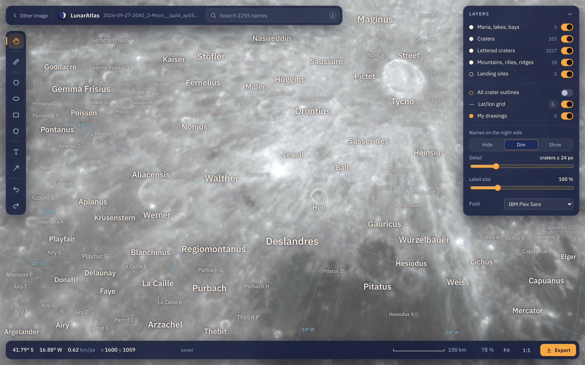
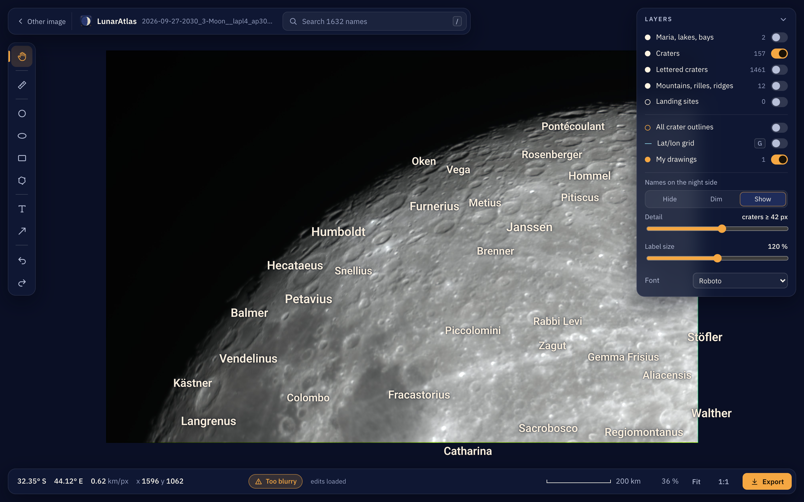

<p align="center">
  
</p>

<h1 align="center">LunarAtlas</h1>
<p align="center">IAU feature names on your own lunar images, like LROC QuickMap but with your data.</p>

<p align="center">
  <a href="https://github.com/kvandebeek/lunaratlas/actions/workflows/test.yml"></a>
  <a href="https://github.com/kvandebeek/lunaratlas/actions/workflows/browsers.yml"></a>
  <a href="https://github.com/kvandebeek/lunaratlas/actions/workflows/build-app.yml"></a>
  <a href="LICENSE"></a>
</p>

<p align="center">
  <a href="https://github.com/kvandebeek/lunaratlas/releases/latest"></a>
</p>

It works on full disks, any phase, mosaics and close-ups without a limb. It finds the image's position,
orientation, mirroring and libration automatically, refuses images too poor to annotate, and exports
labelled images at 1:1 or smaller (never upscaled). A browser viewer lets you search, measure in km,
draw, and move or restyle the labels; your edits are kept and reused by the command-line export.

<p align="center">
  
  
</p>

---

## Download the app

No terminal needed: get the app for your computer from the **[releases page](https://github.com/kvandebeek/lunaratlas/releases)**
and start it — drop a photo of the Moon on its window and the names appear. Exports go to `Pictures/LunarAtlas`.

| macOS | Windows | Linux |
|---|---|---|
| `.dmg` | installer `.exe` | `.tar.gz` |

The first photo downloads about 145 MB of Moon maps (the first close-up about 530 MB more), once. From a
checkout, `python3 lunaratlas/lunaratlas.py app` does the same. Building the app yourself: [`packaging/`](packaging/README.md).

---

## Command line

```sh
python3 lunaratlas/lunaratlas.py locate mosaic_finished.tif   # position the image (10-20 s; close-ups 30-100 s)
python3 lunaratlas/lunaratlas.py view   mosaic_finished.tif   # browser viewer and editor
python3 lunaratlas/lunaratlas.py export mosaic_finished.tif --around Copernicus --size 3600x2400
```

Measured on a 200 Mpx lunar mosaic: 621 terrain matches at 1.56 px RMS (0.43 km).

See [`lunaratlas/README.md`](lunaratlas/README.md) for how the positioning works, the quality gate, the
close-up search, the viewer and every export option.

---

## Requirements

macOS, Linux or Windows. Python 3.14 with numpy, OpenCV and Pillow (`python3 -m pip install -r requirements.txt`). Developed and measured on macOS
(Apple silicon); Linux and Windows should work but are untested, so do tell me if they don't.

Reference data (IAU gazetteer, LROC WAC
albedo, LOLA elevation, fonts) is downloaded once on first use into `lunaratlas/data/`.

---

## Settings

Per-machine settings live in `.env`, which is not committed; [`.env.example`](.env.example) lists every
key with its default. All settings are declared once in [`tool_settings.py`](tool_settings.py) with
their type, default and range, and `.env.example` is generated from it:

```sh
python3 tool_settings.py --check      # value in effect for every setting, with out-of-range warnings
python3 tool_settings.py --example    # regenerate .env.example
```

Set your observing site before locating close-ups: it is used for the parallax, worth up to 1 degree of
libration.

Precedence: command-line option > environment variable > `.env` > built-in default.

---

## Related

[LunarMosaic](https://github.com/kvandebeek/lunarmosaic) builds the gigapixel mosaics this annotates. It
depends on this repository; this one depends on nothing.

## Licence

[Apache License 2.0](LICENSE). Use it, change it, build on it, commercially or not; keep the copyright
notice and say where it came from.

If it saved you time, [sponsoring](https://github.com/sponsors/kvandebeek) is welcome but never expected.
